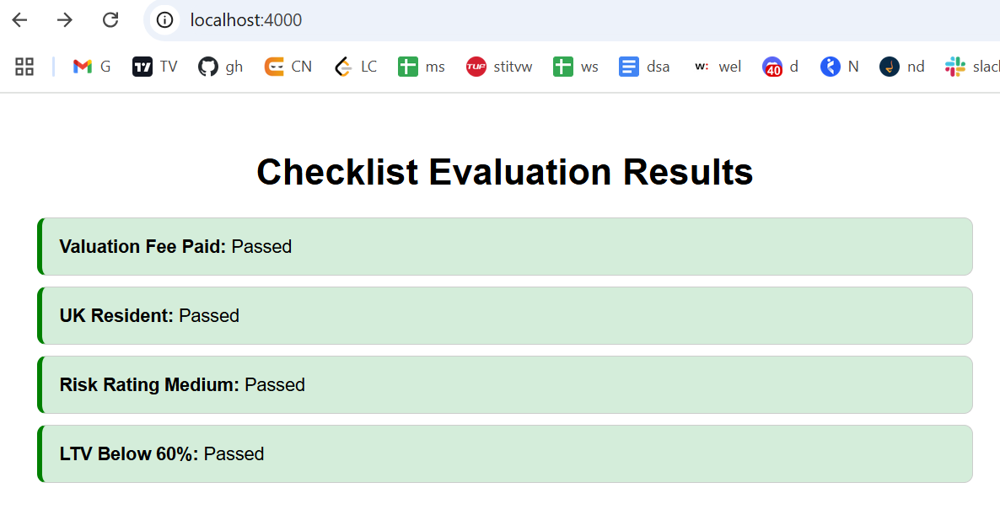

# Result of given API



## Description

This project demonstrates the result of a given API. The API fetches data from a specified endpoint and processes it to generate meaningful insights. The `result.png` image above showcases the output generated by the API.

### Features

- Fetches data from the API endpoint
- Processes and analyzes the data
- Generates visual representation of the results
- Easy to integrate and use

### How to Use

1. Clone the repository.
2. Install the necessary dependencies.
3. Run the application to fetch and process the data.
4. View the results in the generated `result.png` image.

### Installation

```bash
npm i
node index.js
```

### Result

go to localhost where site hosted . Frontend API driectly call there
